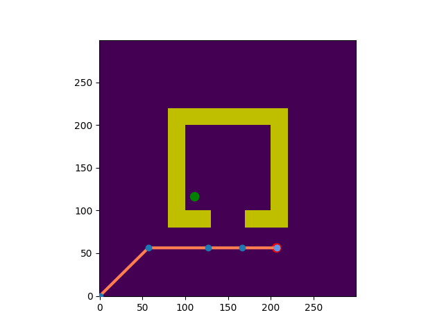
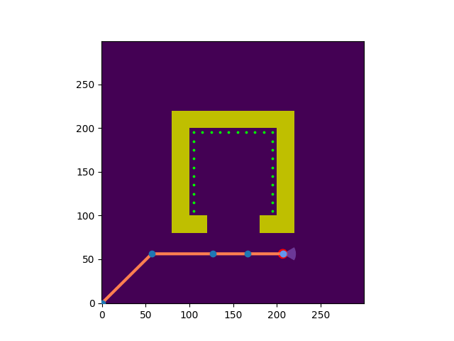

# Nir Manor — Robotics & Autonomous Systems Engineer

**M.Sc. Technion TASP | Automation Engineer @ Unitronics**

---

## 👋 About Me

M.Sc. student at Technion's TASP (Technion Autonomous Systems Program), focused on autonomous systems, multi-agent planning, and motion control. I bridge algorithmic rigor with practical implementation, combining theory, simulation, and real-world validation. Prior industry experience as Control & Automation Engineer at Unitronics, specializing in PLC/HMI programming, industrial protocols, and advanced motion systems.

**Core Expertise:** Multi-agent coordination • Motion planning • Reinforcement learning • Control systems • Industrial automation

---

## 🔬 Featured Research

### Environment-First Planning for Aggregate Transport (AAMAS 2026)

> **Novel environment-centric planning paradigm for autonomous earthwork robotics**

**Publication:** *International Conference on Autonomous Agents and Multiagent Systems (AAMAS), 2026*

Designed and validated a groundbreaking approach to multi-agent coordination for construction robotics, shifting from traditional rover-centric to environment-centric perspective. The algorithm decouples environment representation from individual agent trajectories, enabling near-constant marginal cost for multi-robot scaling.

**Key Achievements:**
- 🎯 **Near-linear scaling:** R² = 0.988 across 7,280 test iterations
- ⚡ **7-9x speedup** through selective update mechanism
- 🔬 **19.5% improvement** from A* continuation reuse (Wilcoxon p=0.009)
- 📊 **Memory efficient:** ~410MB peak, 1.48MB average delta
- 🤖 **Multi-agent ready:** Framework designed for MAPF integration

**Technical Contributions:**
- Trajectory texture fabric with visibility cone constraints
- Heat map generation identifying high-flow corridors
- Spillage modeling via path curvature analysis
- Selective rebuild mechanism (affected region identification)
- 2D↔3D integration validation with PyBullet

**Tech Stack:** Python, NumPy, SciPy, Shapely, PyBullet, A* search, dynamic programming

[📑 Published Paper](link-to-paper) | [📁 Local Implementation](../2D%20Algorithm%20and%20Benchmark/)

---

## 🤖 Robotics & Motion Planning

### Multi-Robot Waiter System

  
  
<i>RRT* motion planning for 4-DOF robotic arm manipulation</i>

**Autonomous multi-robot coordination combining task planning (PDDL) with motion planning (RRT/RRT*)**

Built complete multi-robot system for autonomous restaurant service, coordinating two mobile manipulators to deliver dishes efficiently in dynamic environments.

**Key Features:**
- 🎯 **Task Planning:** PDDL-based task scheduling and order management
- 🗺️ **Base Navigation:** A* + PRM for collision-free 2D navigation
- 🦾 **Arm Planning:** RRT/RRT* for 4-DOF manipulation with iterative rewiring
- 🔄 **Integration:** Combined symbolic planning with geometric motion planning

**Technical Implementation:**
- Forward kinematics and collision detection for manipulator
- Nearest-neighbor search and tree rewiring logic for RRT*
- Multi-query planning for efficient path reuse
- End-effector path cost optimization

**Tech Stack:** Python, UPF (Unified Planning Framework), PDDL, RRT/RRT*, forward kinematics, matplotlib

[📄 Repository](https://github.com/NirManor/Cognitive-Robotics-Waiter)

---

### 6-DOF Robotic Arm Control (UR5e)

  
  
<i>Real UR5e robot performing complex manipulation tasks with wooden blocks</i>

**Complete motion planning system for UR5e collaborative robot**

Developed comprehensive robotic arm control system spanning kinematics, collision detection, and high-dimensional motion planning for complex manipulation tasks.

**Key Achievements:**
- 🎯 **Forward/Inverse Kinematics:** DH parameters with multiple solution handling
- 🔄 **RRT* Planning:** Asymptotically-optimal path planning in 6-DOF C-space
- 🧩 **Complex Task:** 3D bead-threading maze navigation with position + orientation constraints
- ⚙️ **Collision Avoidance:** Sphere-based multi-link collision detection

**Project Highlights:**
- **Project 1-2:** UR5e kinematics + RRT/RRT* global planning
- **Project 3:** Multi-waypoint reaching with geometric object arrangement (spelling "N" and "O")
- **Project 4 (Capstone):** 3D bead maze solving with Fréchet distance optimization

**Technical Details:**
- Numerical inverse kinematics solver with joint limit handling
- k-nearest neighbor rewiring for path cost minimization
- Task-space planning with orientation requirements
- Sim-to-real validation on actual UR5e hardware

**Tech Stack:** Python, NumPy, RRT/RRT*, DH parameters, 3D visualization, real UR5e validation

[📄 Repository](https://github.com/NirManor/AI-and-Robotics)

---

### Motion Planning Algorithms

  
  
  
<i>Multi-target reaching (left) and inspection coverage planning (right)</i>

**Comprehensive implementation of exact and sampling-based planning algorithms**

Implemented and compared fundamental motion planning algorithms from exact methods (visibility graphs) to sampling-based approaches (RRT*) with application-specific extensions.

**Implemented Algorithms:**
- 📐 **Exact Planning:** Minkowski sums, visibility graphs, Dijkstra shortest path
- 🎲 **Sampling-Based:** Weighted A* (grid), RRT, RRT* with asymptotic optimality
- 🎯 **Application Planning:** Multi-target reaching, inspection coverage optimization

**Key Results:**
- **HW1:** Minkowski sum C-space computation + visibility graph construction for diamond robot
- **HW2:** Comparative analysis of Weighted A* (ε tuning), RRT (goal bias sensitivity), RRT* convergence
- **HW3:** Task-specific planners with coverage metrics and path cost minimization

**Performance Analysis:**
- Success rate >95% with goal biasing
- RRT* converges to near-optimal solutions
- Parameter sensitivity analysis (goal probability 5%-20%, heuristic weights 1-20)

**Tech Stack:** Python, NumPy, Matplotlib, computational geometry, probabilistic roadmaps

[📄 Repository](https://github.com/NirManor/Algorithmic-Motion-Planning)

---

## 🚁 Reinforcement Learning

### Quadcopter Autonomous Flight Control

  
  
<i>PPO agent learning autonomous flight control and stabilization</i>

**Model-free deep RL for autonomous quadcopter stabilization and navigation**

Developed deep reinforcement learning agents (PPO, A2C) that learn to control a quadcopter in 3D space without explicit physics models or pre-programmed control laws.

**System Architecture:**
- 🎯 **State Space (16D):** Quaternion orientation, position, velocities, target
- 🔧 **Action Space (4D):** Propeller thrusts [0, 3.18825] N per motor
- 🎁 **Reward Function:** Multi-objective balancing stabilization, vertical tracking, horizontal distance

**Key Challenges Solved:**
- **Python-CoppeliaSim Synchronization:** Synchronous mode, blocking API calls, communication pause-resume
- **Reward Shaping:** Progressive curriculum learning across multiple training sequences
- **Sample Efficiency:** Algorithm comparison (PPO vs A2C), hyperparameter tuning

**Training Results:**
- ✅ **Total Timesteps:** 350,000+ across multiple sequences
- ✅ **Network Architecture:** [128, 128] neurons, discount γ=0.95
- ✅ **Best Sequence:** Sequence 3 (curriculum learning + PPO)

**Tech Stack:** Python, CoppeliaSim, Gymnasium, Stable-Baselines3, PPO/A2C, reward engineering

[📄 Repository](https://github.com/NirManor/rl-quadcopter-control)

---

## 🎮 AI & Decision-Making

### Multi-Agent Game Search & Machine Learning

**Game-playing AI and supervised learning implementations**

Implemented classical AI algorithms for adversarial search and machine learning, demonstrating mastery of fundamental decision-making techniques.

**Game Search (Multi-Agent Environments):**
- 🎯 **Minimax:** Full game-tree exploration with optimal move selection
- ⚡ **Alpha-Beta Pruning:** 8-10x speedup over Minimax while preserving optimality
- 🎲 **Expectimax:** Probabilistic opponent modeling for uncertain environments
- 🎨 **Custom Heuristics:** Multi-objective evaluation (score, resources, tactical positioning)

**Machine Learning (Decision Trees & MDPs):**
- 🌲 **ID3 Algorithm:** Information gain-based feature selection with entropy splitting
- 📊 **Continuous Features:** Dynamic threshold discretization for real-valued data
- 🔄 **Cross-Validation:** k-fold hyperparameter tuning (tree depth optimization)
- 🎯 **MDPs:** Value Iteration and Policy Iteration for sequential decision-making

**Application:** 5×5 warehouse game with competitive agents; medical diagnosis with 30 continuous features

**Tech Stack:** Python, NumPy, game tree search, decision trees, dynamic programming

[📄 Repository](https://github.com/NirManor/Intro-to-AI)

---

## ⚙️ Control Systems

### Advanced Robot Control (KDCR)

**Comprehensive control systems: kinematics, dynamics, and 5 control strategies**

Developed complete robotic control pipeline from geometric motion to dynamic behavior to adaptive control, with rigorous comparative analysis across multiple control methodologies.

**System Components:**

**Kinematics:**
- 🎯 **Forward Kinematics:** Homogeneous transformation matrices (4×4) for arbitrary serial/parallel manipulators
- 🔄 **Inverse Kinematics:** Analytical and numerical solutions with 8 solution branches (3-DOF arm)
- 📊 **Jacobian Analysis:** Full 6×6 matrices, singularity detection, force/torque mapping

**Dynamics:**
- ⚙️ **Euler-Lagrange Formulation:** Inertia matrices H(q), Coriolis/centrifugal C(q,q̇), gravity G(q)
- 📐 **Parallel Robot Kinematics:** 2D parallel manipulator with constraint equations

**Control Strategies (Comparative Analysis):**
1. **Inverse Dynamics + PD:** Model-based control with computed torque
2. **PD + Gravity Compensation:** Improved robustness without full dynamics
3. **PID Control:** Model-independent with integral action
4. **MINMAX Robust Control:** Handles bounded parametric uncertainty (load 0-0.5 kg)
5. **Adaptive Control:** Real-time parameter estimation via Lyapunov stability

**Performance Results:**
- ✅ **Tracking Error:** <0.15% nominal, <0.20% with 25% uncertainty
- ✅ **Robustness:** Adaptive maintained 99.5% performance under load variations
- ✅ **Trade-offs:** MINMAX highest robustness but 15-20% torque chattering; Adaptive best smoothness

**Tech Stack:** MATLAB (1500+ lines), Euler-Lagrange mechanics, Lyapunov stability, trajectory planning

[📄 Repository](https://github.com/NirManor/KDCR-Control-Systems)

---

## 📊 Technical Skills

### Algorithms & Autonomy
Multi-agent path planning • RRT/RRT* • A* • Dijkstra • SLAM • Extended Kalman Filter • Factor graphs • GTSAM • Belief space planning • Reinforcement learning (PPO, A2C) • MDP • Minimax • Alpha-Beta Pruning • Decision trees

### Programming & Tools
Python (primary) • C/C++ (embedded) • MATLAB • ROS • PLC/HMI programming (ladder logic, structured text) • Git • NumPy • SciPy • Matplotlib

### Robotics & Simulation
CoppeliaSim • PyBullet • Gazebo • GTSAM (Georgia Tech Smoothing and Mapping) • Forward/inverse kinematics • Jacobian analysis • Collision detection • Trajectory planning

### Industrial Automation & Protocols
Motion control systems • Servo synchronization • EtherCAT real-time control • Modbus (RTU/TCP) • CANopen • BACnet/IP • MQTT • Ethernet/IP • SQL connectivity • Raw serial/TCP/CAN (Layer-2)

---

## 📚 Publications

- **Environment-First Planning for Aggregate Transport: Foundations for Multi-Agent Systems**
  *International Conference on Autonomous Agents and Multiagent Systems (AAMAS), 2026*
  **Authors:** Nir Manor, et al.

---

## 💼 Experience

### Unitronics — Automation & Control Engineer (2021–Present)

Automation and control engineer with expertise in PLC/HMI programming, industrial communication protocols, and advanced motion systems. Design and implement full automation solutions from initial architecture through field deployment.

**Key Contributions:**
- ⚙️ **Motion Control:** Designed servo axis synchronization, EtherCAT-based real-time control, gear ratio mapping, encoder feedback scaling
- 🔌 **Custom Interfaces:** Built communication interfaces for unsupported devices using raw serial/TCP/CAN (Layer-2) messaging
- 🏗️ **Complete Projects:** Delivered PLC/HMI programming, device integration, system commissioning, legacy migrations
- 🔧 **Troubleshooting:** Diagnosed firmware regressions, communication instability, SQL faults, multi-protocol conflicts
- 📡 **Protocol Expert:** Modbus, CANopen, BACnet/IP, MQTT, Ethernet/IP, EtherCAT, SQL
- 👨‍🏫 **Technical Training:** Provided remote/on-site customer training on system design and troubleshooting
- 🔬 **R&D Bridge:** Prepared reproduction scenarios and structured Jira reports for issue resolution

---

## 🎯 Why This Portfolio?

This portfolio demonstrates:

✅ **Theory to Practice:** Academic research (AAMAS publication) + industry experience (4+ years Unitronics)
✅ **Full-Stack Robotics:** From high-level planning (PDDL, A*) to low-level control (Lagrangian dynamics, PID)
✅ **Multi-Domain Expertise:** Multi-agent systems, motion planning, RL, control theory, industrial automation
✅ **Production Mindset:** Real hardware validation (UR5e), field deployment, customer support, troubleshooting
✅ **Algorithm Rigor:** 7,280 test iterations, statistical validation (Wilcoxon p-tests), comprehensive benchmarking

---

## 🔗 Connect

- 📧 **Email:** nir.manor2023@gmail.com
- 💼 **LinkedIn:** [linkedin.com/in/nir-manor](https://linkedin.com/in/nir-manor)
- 🎓 **GitHub:** [github.com/NirManor](https://github.com/NirManor)

---

  <i>Building autonomous systems that bridge algorithmic rigor with real-world deployment</i>

